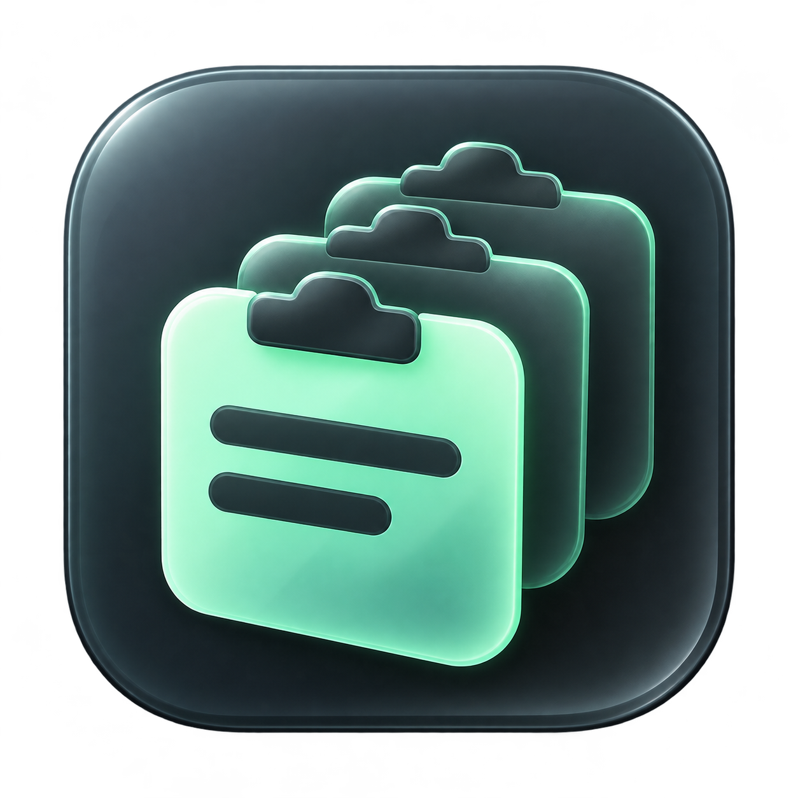
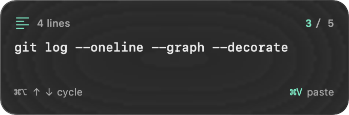

# ClipShelf



A small, keyboard-first clipboard manager for macOS. Keep text, code, images, PDFs, and Finder files within reach, with a compact glass preview and local storage.

## Why I’m building this

I’ve tried many clipboard managers. As a programmer, I’m constantly copying commands, code snippets, notes, and files, but none of the ones I tried felt as simple and quick as I wanted for my own workflow.

So I started building ClipShelf for myself: something small that lets me cycle through recent clips, find the right one, and paste without reaching for the mouse. Sometimes I also want to save a snippet—or a series of clips—to a file, so that’s built in too.

I’m keeping it deliberately simple and improving it as I use it. I hope it’s useful to other developers and anyone who spends their day copying and pasting.

## What it does

- Keeps recent text, code, images, PDFs, and files copied from Finder.
- Cycles through history from the keyboard without taking focus from your editor.
- Shows a small, frosted-glass preview tucked into a screen corner.
- Searches history and pins snippets you want to keep.
- Exports text clips into one file, or saves mixed clips into a folder.
- Stores everything locally, with pause and clear-history controls.



## Keyboard shortcuts

| Shortcut | Action |
| --- | --- |
| **⌘⌥↓** | Cycle to an older clip |
| **⌘⌥↑** | Cycle toward newer clips |
| **⌘V** | Paste the clip into your current app |
| **⌘⇧V** | Open searchable clipboard history |
| **↑ / ↓** in history | Choose a clip |
| **Return** in history | Put the chosen clip on the clipboard and return to your app |
| **Escape** in history | Close the panel |
| **⌘S** in history | Export the current or selected clips |
| **⌘Q** in history | Quit ClipShelf |

## Download and install

Download the **macOS universal ZIP** from [GitHub Releases](https://github.com/sahilparekh/clipself/releases). It includes the app for **Apple Silicon and Intel Macs**, and requires **macOS 13 or later**. You do not need Swift or build tools.

Extract the ZIP, drag `ClipShelf.app` into **Applications**, and open it. ClipShelf runs in the menu bar; copy a few items normally, then use **⌘⌥↑ / ↓** to cycle.

The first downloadable builds are previews with an ad-hoc signature. They are **not Developer ID signed or notarized by Apple**, so macOS may block the first launch. If you trust the download, after trying to open it, use **System Settings → Privacy & Security → Open Anyway** for this app. See [Apple’s instructions](https://support.apple.com/en-us/102445).

## Build from source

Requires **macOS 13 or later** and Apple’s Swift Command Line Tools. There are no third-party runtime dependencies or cloud services. The Python 3 fallback icon packer is only used if the native icon converter is unavailable.

Clone and build:

```sh
git clone https://github.com/sahilparekh/clipself.git
cd clipself
./scripts/build-app.sh
open dist/ClipShelf.app
```

If Swift is not installed, install Apple’s Command Line Tools with `xcode-select --install` first.

Move the built app into Applications if you want to keep it. To start it at login, add it in macOS System Settings → General → Login Items.

After rebuilding, double-click `dist/Restart-ClipShelf.command` to start the new binary. It retires earlier ClipShelf instances before registering shortcuts. Shortcut registration errors remain visible at the top of the history panel; its bottom menu includes **Test cycling preview**.

The 340 × 112 point glass preview appears in the corner farthest from your pointer on its display, stays in place while cycling, and disappears 2.5 seconds after the last cycle. It does not take keyboard focus or intercept clicks. Placement uses the mouse position, not your editor’s text caret.

## Everyday use

- Copy normally. ClipShelf captures text, image pixels, PDF data, and files copied from Finder, including multiple files in one copy.
- Press **⌘⌥↓** to cycle to older clips, or **⌘⌥↑** to cycle toward newer clips. A floating card previews the selected clip. Your current app keeps keyboard focus. Press **⌘V** to paste normally.
- Cycling wraps at the ends and keeps a fixed order; it does not rearrange your history. A fresh copy starts a new cycle from the newest clip.
- For search and organizing, click the clipboard in your menu bar or press **⌘⇧V**. Type to search, use **↑ / ↓** to choose a clip, and press **Return**. The panel closes and returns focus to your previous app; press **⌘V** there. **Escape** closes without changing the clipboard.
- Pin reusable commands. Repeat copies move the existing clip to the top.
- Choose **Save clip…** to save the current clip. Tick checkboxes to export several clips. Text-only selections combine into a single UTF-8 file with a blank line between clips, oldest first. Indentation and line endings within each clip are preserved.
- A single image saves as PNG; raw PDF data saves as PDF. Single Finder files are copied to the chosen destination. Mixed selections and groups of files save as separate items in a chosen folder; existing destination files are kept and filenames get numbered suffixes when needed.
- Use the pause button before copying sensitive text. The menu at the bottom offers clear history and quit.
- To exit, right-click the menu-bar clipboard icon and choose **Quit ClipShelf**. You can also press **⌘Q** while the history panel is open, or use its bottom-right **⋯** menu. **Escape** closes the panel without quitting.

## Storage and scope

The app stores up to 200 recent clips, plus pinned clips, in `~/Library/Application Support/ClipShelf/history.json`. Unpinned stored content is also limited to 100 MB. History stays on this Mac in a JSON file with owner-only permissions; it is not encrypted. Image and PDF bytes are stored in the history. Finder file clips store paths to the originals, not backup copies. Moving or deleting an original makes that clip unavailable; copying it again updates history. Clear history removes saved clips, including pins; it does not clear the macOS clipboard or delete any original files.

Clipboard capture polls every half second, so extremely rapid clipboard changes may be missed. Text is limited to 1 MB and image/PDF clipboard data to 20 MB per clip; Finder file references have no content-size limit. PNG and TIFF clipboard images are supported, with TIFF converted to PNG. Finder files can have any extension. It ignores clipboard content marked concealed, transient, or autogenerated by the source app. Sensitive content without those markers can still be captured; pause recording when needed. Items already on your clipboard before launch are not imported. Changes while paused are skipped.

No Accessibility permission is required: the app prepares the clipboard and you paste with ⌘V. The destination must accept the content: Finder accepts file clips, image editors accept image pixels, and text editors accept text. Selecting a PDF file does not turn it into text. If another app owns a shortcut, ClipShelf reports the conflict; the panel remains accessible from the menu-bar icon.

## Develop

```sh
./scripts/build-app.sh
./scripts/test.sh
./scripts/render-preview.sh
./scripts/build-icon.sh
./scripts/package-release.sh
```

The tests cover recency, retention, old-history migration, binary persistence, both cycle directions, and mixed exports without overwriting files. A separate named pasteboard checks file/image/PDF round trips without touching your normal clipboard. That check is reported as skipped if the environment blocks the macOS pasteboard service.

The scripts compile directly with the Swift compiler and keep module caches in the project. A Swift package is also included for IDE use. The app bundle is signed locally with an ad-hoc signature. Distribution to other Macs would need Developer ID signing and notarization.

The application icon is included in `Assets/AppIcon.icns`. Its transparent source artwork and generation prompt are retained in `Assets/`; `build-icon.sh` rebuilds the native iconset.

## Publishing a release

Set `VERSION`, add release notes under `docs/releases/v<VERSION>.md`, commit the changes, and push a matching `v<VERSION>` Git tag. The GitHub Actions release workflow runs the checks, compiles both architectures, and publishes the installable ZIP and SHA-256 checksum as a preview release. Developer ID signing and notarization are not configured yet.

## License

[MIT](LICENSE) © 2026 Sahil Parekh.
